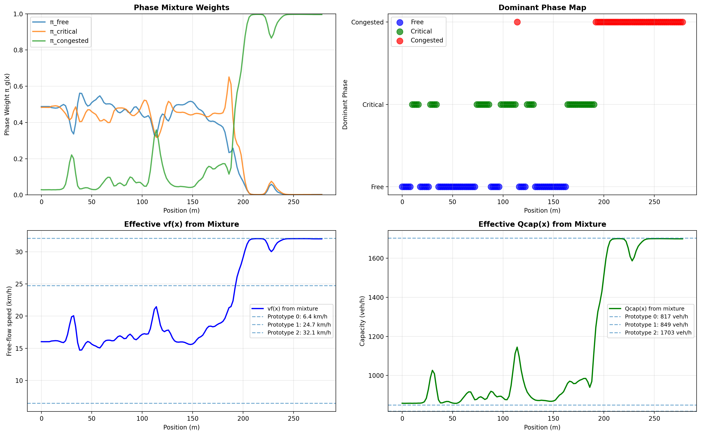
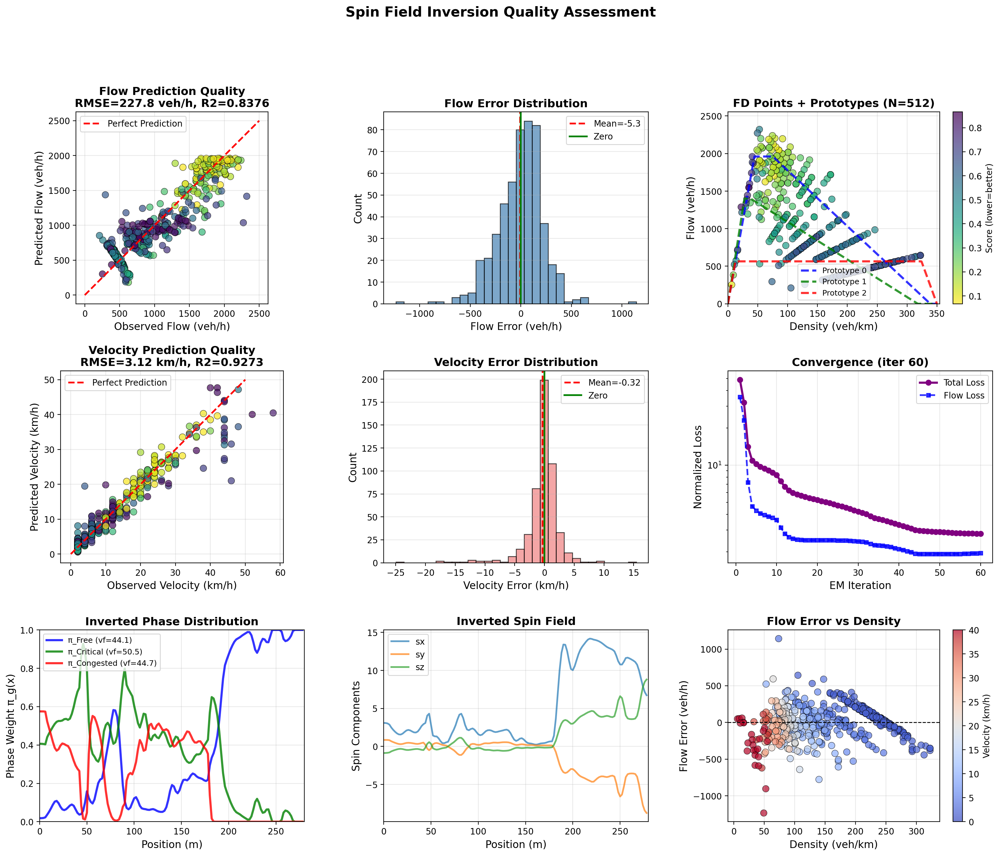

# SpinFlow: Physics-Informed Traffic State Inversion Framework

**A Traffic Flow Inversion Framework Based on Statistical Physics Spin Systems and Kerner's Three-Phase Theory**

 

## 📖 Introduction

**SpinFlow** is a physics-informed traffic state inversion framework. It innovatively introduces the **Heisenberg Spin Model from statistical physics** to describe the evolution of traffic phases. Combined with **Kerner's Three-Phase Traffic Theory**, it achieves high-precision modeling and inversion of complex traffic congestion propagation mechanisms.

Traditional traffic flow theories, typically based on continuum assumptions, struggle to accurately capture "Synchronized Flow"—a critical metastable state. SpinFlow introduces a **microscopic spin field** as a latent variable and constructs a **Competitive Balance Perception Mapping**. This successfully unifies the competition mechanism between free flow and congested flow mathematically, and naturally explains the emergence of synchronized flow at the point of competitive balance.


> **Note: Core solver and phase mapping logic are currently withheld pending paper publication.**

---


## 📊 Experimental Results

The following results are generated based on real-world **elevated highway bottleneck** trajectory data.

### 0. Scenario Overview
The study area is a typical urban elevated highway bottleneck, approximately 362 meters long. It features significant merging and diverging points, with the number of lanes narrowing from 10 to 6, presenting a complex evolution of traffic phases.


### 1. Spacetime Evolution & Phase Identification
The figure below shows the reconstructed spacetime density field. SpinFlow accurately outlines the **spacetime wavefront** of congestion and automatically identifies three key regions: **Free Flow (Blue)**, **Critical/Synchronized (Green)**, and **Congested (Red)**. Note that the green region (synchronized flow) is accurately captured as the transition zone between free and congested flow.


### 2. Spin Field & Phase Mixture Distribution
This is the core output of SpinFlow. The top plot shows the spatial variation of the three-phase mixture weights, while the bottom plot shows the distribution of latent spin field components. At the bottleneck (around 200m), the congested phase weight (red) rises significantly, and the spin components undergo a dramatic flip—the microscopic physical signal of a **phase transition**.



### 3. Inversion Quality & Diagnostics
The figure below demonstrates the comprehensive fitting performance of the algorithm. The first row compares predicted flow vs. observed flow (high fitting accuracy); the second row shows the error distribution for velocity prediction; the third row provides integrated analysis of the phase map, spin field, and error space. The results show that the model achieves high data fitting precision while maintaining physical interpretability.



---

## 📂 Project Structure

```text
spinflow/
├── data/                  
├── results/               
├── spin_inversion/        
│   ├── __init__.py        
│   ├── main.py            
│   ├── solver.py          
│   ├── fd_model.py         
│   ├── phase_utils.py      
│   ├── preprocessing.py    
│   ├── evaluator.py        
│   ├── viz_diagnostics.py  
│   └── viz_spacetime.py                 
├── requirements.txt        
├── LICENSE                 
└── README.md        
```

## 📝 Citation & License

This project is licensed under the **MIT License**. If you use the code or ideas from this project in your research, please cite the relevant paper.

---
© 2025-2026 SpinFlow Team.


