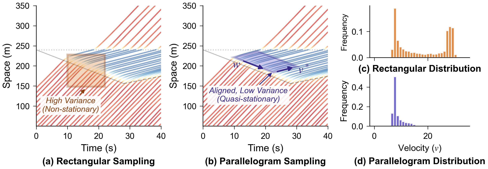
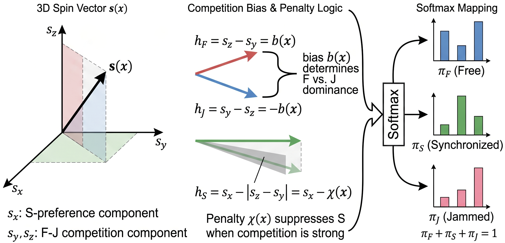
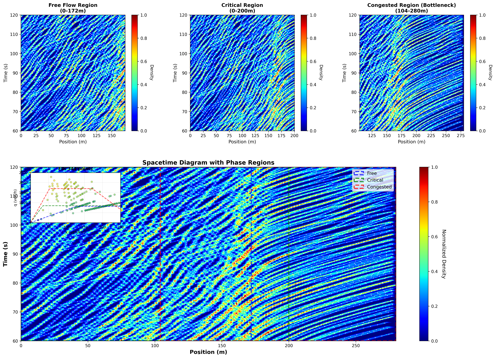
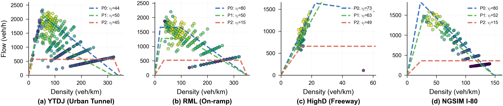
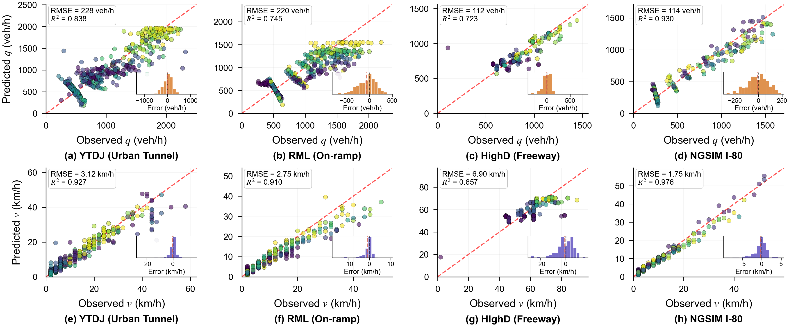
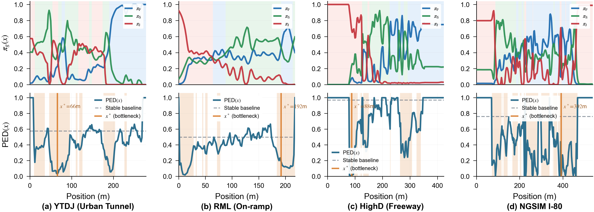
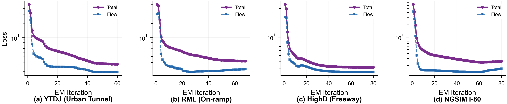
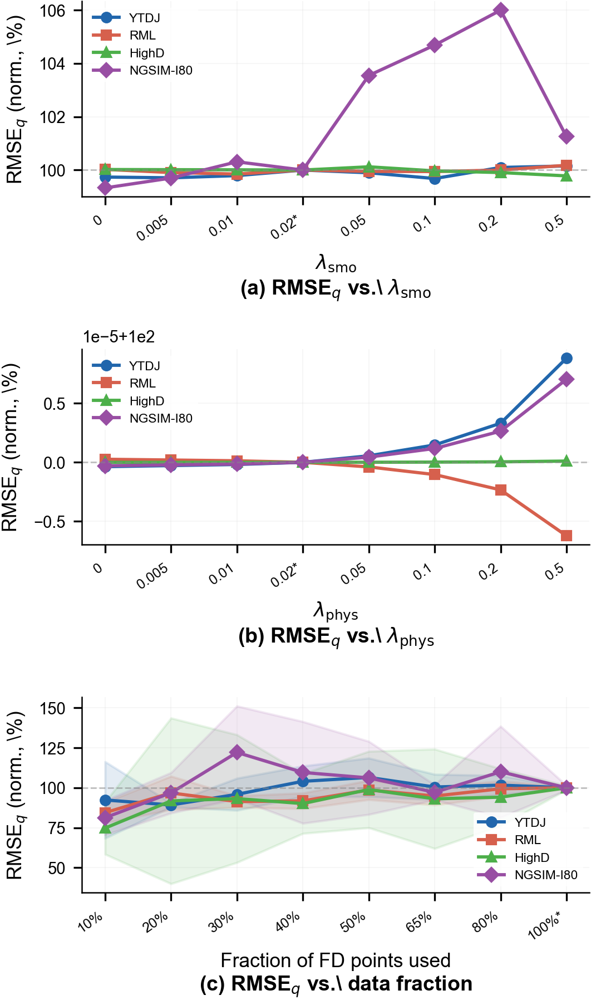

# SpinFlow: A Physics-Informed Spin Field Framework for Traffic Phase Inference and Transition Detection

[](LICENSE)
[](https://www.python.org/)
[](https://arxiv.org/abs/2605.23306)

This work has been accepted for an oral presentation at the IEEE International Conference on Intelligent Transportation Systems (ITSC) 2026.

## 📖 Introduction

SpinFlow is a physics-informed traffic state inversion framework. It innovatively introduces the Heisenberg Spin Model from statistical physics to describe the evolution of traffic phases. Combined with Kerner's Three-Phase Traffic Theory, it achieves high-precision modeling and inversion of complex traffic congestion propagation mechanisms.

Traditional traffic flow theories, typically based on continuum assumptions, struggle to accurately capture "Synchronized Flow"—a critical metastable state. SpinFlow introduces a microscopic spin field as a latent variable and constructs a Competitive Balance Perception Mapping. This successfully unifies the competition mechanism between free flow and congested flow mathematically, and naturally explains the emergence of synchronized flow at the point of competitive balance.

---

## 📐 Method overview

These panels illustrate the observation and mapping mechanics; they are schematic or conceptual rather than dataset-specific empirical plots.

### Parallelogram quasi-stationary sampling

Parallelogram-aligned windows in the time–space plane align with wave propagation and reduce shock-induced bias in fundamental-diagram estimation compared with naive rectangular windows.



### Competitive equilibrium mapping

The spin-to-phase pipeline: competition bias and penalty shape the preference scores, and the softmax mapping yields phase mixture weights along the corridor.



---

## 📊 Experimental Results

This section summarizes representative inversion and validation outputs: a bottleneck site context, trajectory-conditioned spacetime structure, and manuscript-scale panels that compare forward fit, inferred phase geometry, and optimization behavior.

### 0. Scenario overview (YTDJ)

The study area is a typical urban elevated highway bottleneck, approximately 362 meters long. It features significant merging and diverging points, with the number of lanes narrowing from 10 to 6, presenting a complex evolution of traffic phases.


### 1. Spacetime evolution and phase identification (YTDJ)

The reconstructed spacetime density field outlines the congestion wavefront and separates Free Flow (blue), Critical/Synchronized (green), and Congested (red), with synchronized flow occupying the transition band between free and queued traffic.



### 2. Calibrated three-phase prototype fundamental diagrams

EM-calibrated triangular FD prototypes for free, synchronized, and wide-moving-jam phases; scatter points are quality-weighted parallelogram samples.



### 3. Forward consistency

Observed versus mixture-implied flow and speed with residual diagnostics.



### 4. Phase inference and PED-based localization

Spatial phase weights and Phase Equilibrium Degree profiles, with non-equilibrium zones and the primary bottleneck site marked.



### 5. EM convergence

EM training dynamics versus iteration for the joint spin–FD inversion.



### 6. Hyperparameter sensitivity analysis



---

## 📂 Project Structure

```text
spinflow/
├── data/
├── results/
├── configs/
├── experiments/
├── scripts/
│   ├── evaluator.py
│   ├── viz_diagnostics.py
│   ├── viz_spacetime.py
│   └── ...
├── src/
│   └── spinflow/
│       ├── main.py
│       ├── solver.py
│       ├── fd_model.py
│       ├── phase_utils.py
│       ├── preprocessing.py
│       ├── sampler.py
│       ├── observation.py
│       └── ...
├── requirements.txt
├── pyproject.toml
├── LICENSE
└── README.md
```

---

© 2025–2026 SpinFlow Team.
