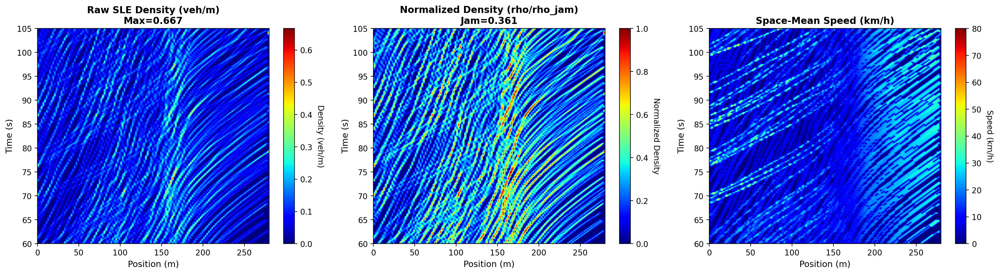
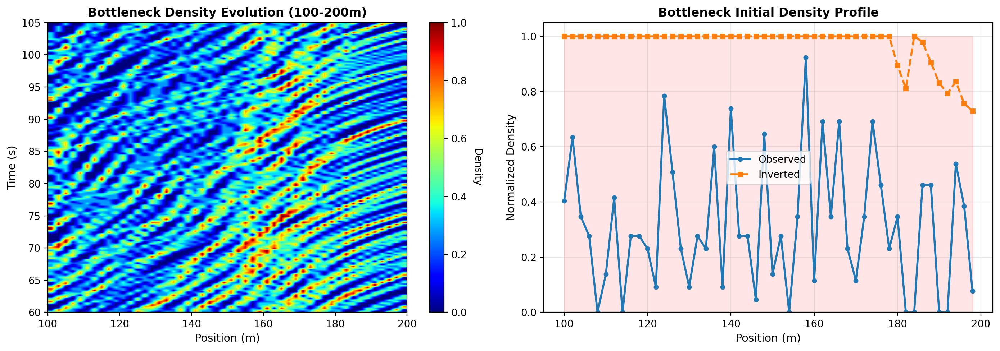

## YTDJ Trajectory Inversion (Strict Edie + Single-Lane Equivalency)

This repository reconstructs the initial traffic density field and a spin field from YTDJ drone trajectory data. It uses the Strict Edie formulation for space–time aggregation and Single‑Lane Equivalency (SLE) to normalize multi‑lane observations into an equivalent one‑lane representation. The output serves as consistent, data‑driven initial conditions for macroscopic simulation and analysis.

### Road layout


### Research context and objective
- **Core goal**: build a statistical‑physics interpretation framework for traffic flow.
- **From spin systems to traffic dynamics**: treat the driver collective as an evolving, spin‑like order parameter that modulates free‑flow speed, capacity and jam density within a conservative CTM backbone. This preserves conservation while enabling inertia, hysteresis, non‑equilibrium and emergent patterns.

### Baselines and explainability
- **Baselines**: classical LWR/CTM family and the second‑order **Aw–Rascle–Zhang (ARZ)** model.
- **Explainability (examples)**: (1) reproduce phase transitions (hysteresis, capacity drop, stop‑and‑go waves) under measured boundaries; (2) parameters map to behaviorally meaningful quantities; (3) causal linkage from local order parameter to macroscopic observables.

### ARZ in brief
ARZ augments LWR with a dynamical “effective/desired velocity” equation while keeping the conservation structure. It restores proper characteristics and captures inertia and driver memory, offering a principled analytical baseline for non‑equilibrium traffic alongside CTM.

### Position of this repository
This repo provides a data‑driven inversion pipeline (Strict Edie + SLE + SPSA) to recover initial density and a spin‑like field from trajectories, generate diagnostics, and supply artifacts for forward simulations and model comparisons. For tuned settings and discussion, see `PARAMETER_OPTIMIZATION_SUMMARY.md`.

---

### Quick start
- Run the standard experiment (recommended):
```bash
run_standard_experiment.bat
```

- Or run manually:
```bash
# 1) Inversion from trajectories
python ytdj_inverse_init.py \
  --csv data/VTDJ_6-10.csv \
  --direction eb \
  --road-length 362 \
  --cells 150 \
  --dt-obs 0.25 \
  --t0 60 \
  --T-obs 45 \
  --use-sle \
  --lanes all \
  --group-size 5 \
  --K-inv 35 \
  --iters 40 \
  --use-spsa \
  --save-prefix results/optimal

# 2) Generate analysis plots
python generate_analysis_plots.py
```

---

### Results (saved in `results/`)

- Density comparison (observed vs. normalized vs. speed)



- Bottleneck focus (100–200 m)



To load the inversion data:
```python
import numpy as np
data = np.load('results/optimal_inverse_init.npz', allow_pickle=True)
rho0 = data['rho0']   # initial density [cells]
sx0 = data['sx0']; sy0 = data['sy0']; sz0 = data['sz0']
meta = data['meta'].item()  # metadata dict
```

---

### Method highlights
- Strict Edie aggregation: correctly accumulates vehicle‑seconds Θ and vehicle‑meters Ξ over space–time cells; density ρ = Θ/(Δx·Δt), flow q = Ξ/(Δx·Δt).
- Single‑Lane Equivalency (SLE): estimates the effective lane profile L(x) from observations and normalizes multi‑lane density as ρ_SLE = ρ_all / L(x); robust to lane drops (5 → 1 lane bottleneck).
- SPSA optimization: two simulations per iteration, efficient for higher‑dimensional inversion.

---

### Data
- Input trajectories: `data/VTDJ_6-10.csv` (eastbound, lanes 6–10; road length ≈ 362 m; lane drop near the bottleneck).


